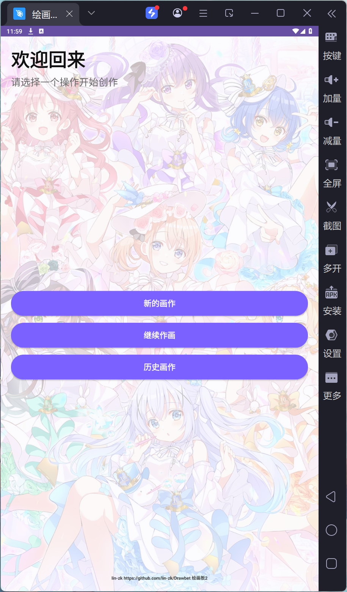
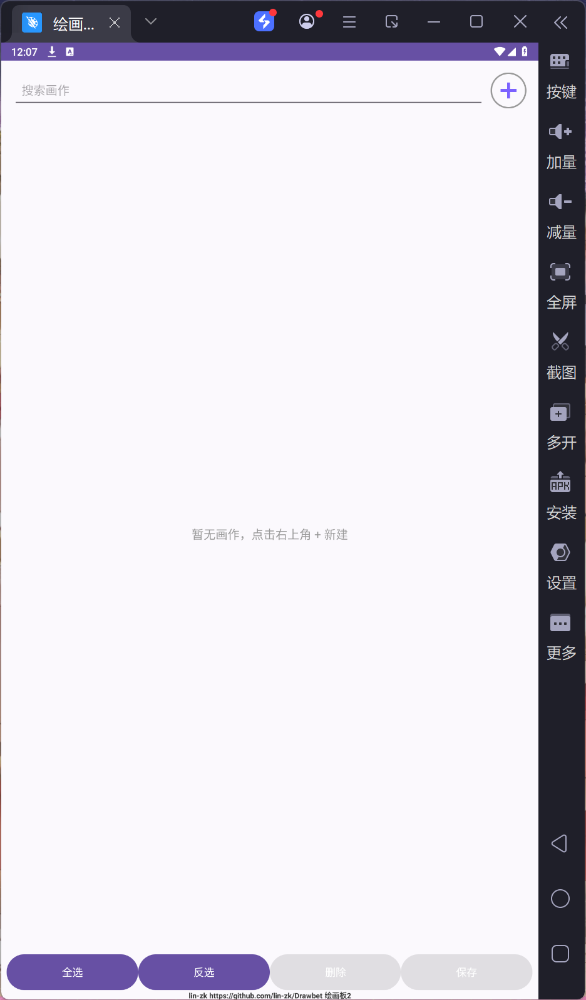

[中文](README.md) | English | [日本語](README_JA.md)

# Drawbet - Simple Drawing App

---

## 📱 About

Drawbet is a simple and easy-to-use Android drawing application that supports multiple brush styles, color adjustments, and drawing history management. Perfect for capturing creative inspirations anytime, anywhere.

---

## 📖 Features

### 🏠 Home Page



- **New Drawing**: Create a new drawing with custom naming (default format: `NewDrawing_CurrentTime`)
- **Continue Drawing**: Quickly load the most recently edited drawing
- **History**: Browse and manage all saved drawings
- Beautiful illustration background with semi-transparent overlay, aesthetically pleasing and theme-appropriate
- Author information displayed at the bottom

### 🎨 Drawing Page


- **Drawing Tools**: Four drawing modes available
  - Brush: Free-form line drawing
  - Eraser: Erase drawn content
  - Circle: Draw ellipses/circles
  - Rectangle: Draw rectangles
- **Brush Size**: Adjust brush thickness via slider with real-time preview on the left circular view
- **Color Adjustment**: Freely adjust brush color using RGB sliders with real-time preview on the left circular view
- **Undo/Redo**: Support for multi-step undo and redo operations
- **Clear Canvas**: One-click canvas clearing (confirmation required)
- **Auto-save Drawing**: Automatically save drawing to database when changes detected
- **Export Image**: Click the save button to export drawing as JPG to phone gallery; long press the save button to go to history page
- **Shake to Clear**: Shake the phone to quickly clear the canvas (confirmation required)
- **Rename**: Click on the drawing title at the top to rename
- **Auto-save**: Automatically saves undo/redo stacks when drawing changes

### 📂 History Page



- **Search**: Instant search as you type, matching parts of drawing names are highlighted in red
- **New Drawing**: Click the `+` button in the top right to create a new drawing
- **Drawing List**:
  - Displays thumbnail, name, and last modified time
  - Click on name to rename
  - Click on drawing to enter edit mode
  - Checkbox support for batch selection
- **Batch Operations**:
  - Select All/Deselect: One-click select all or deselect
  - Invert: Invert current selection
  - Delete: Batch delete selected drawings
  - Save: Batch export selected drawings as JPG images to phone gallery
- Shows "No drawings, click + in top right to create" when empty
- Scroll support for browsing many drawings

### 👤 About Page
- Long press the "Clear" button to access the About page

---

## 🛠️ Technical Implementation

### Project Structure
```
app/src/main/java/com/example/majordesign_master_v1/
├── MainActivity.java        # Main drawing page logic
├── HomeActivity.java        # Home page logic
├── HistoryActivity.java     # History page logic
├── WrittingView.java        # Custom drawing view
├── AboutPage.java           # About page
├── data/                    # Data layer
│   ├── DrawingDao.java      # Data Access Object
│   ├── DrawingDatabase.java # Room database
│   ├── DrawingEntity.java   # Drawing entity
│   ├── DrawingRepository.java # Data repository
│   ├── DrawingState.java    # Drawing state
│   └── BitmapConverters.java # Bitmap conversion utilities
└── history/                 # History UI
    ├── HistoryAdapter.java  # List adapter
    └── HistoryViewModel.java # ViewModel
```

### Key Technologies
- **Layout**: Linear vertical layout using LinearLayout
- **Custom View**: WrittingView implements canvas functionality
- **Data Storage**: Room database for persistent drawing data storage
- **Style Resources**: Drawable resources for rounded rectangles, circular views, gradient backgrounds, etc.
- **Sensors**: Accelerometer sensor for shake-to-clear functionality

### 🗂️ Data & Storage
- **Autosave**: Persists the undo/redo stack every 30 seconds on the drawing page and when the app goes to background or exits
- **Local database**: Room stores drawing names, thumbnails, and canvas state (`DrawingState` / `BitmapConverters`)
- **Image export**: Saves JPGs to the system gallery via MediaStore using the drawing name; defaults to `NewDrawing_yyyyMMdd_HHmmss` when unnamed
- **Permissions**: Exporting requires gallery write access; on Android 10+ this uses scoped storage without legacy permissions

### Development Steps Summary

1. Build three main pages: Home, Drawing, and History pages
2. Design home page layout with three entry points: New Drawing, Continue Drawing, History
3. Design drawing page with brush size adjustment, brush style selection, canvas, color adjustment, and action buttons
4. Design history page with search, create new, and batch operation features
5. Create drawable and style resources for beautiful UI effects
6. Implement MainActivity interaction logic
7. Implement WrittingView drawing functionality
8. Implement HomeActivity home page behavior
9. Implement HistoryActivity for history management
10. Create data and history packages for database and UI interface management
11. Design About page

---

## 🚀 Running the Project

### Requirements
- Android Studio 2024.1+ (Android Gradle Plugin 8 compatible)
- Android SDK: compileSdk 36 / targetSdk 36, minSdk 24
- JDK 11
- Gradle Wrapper 8.13 (included)

### Build Steps
```bash
# Clone the project
git clone https://github.com/lin-zk/Drawbet.git
cd Drawbet
# Build the project
./gradlew build
```

---

## 📄 License

This project is released under the **[MIT License](LICENSE)**.

---

## 🤝 About the Author
- **Author**: lin-zk
- **Email**: 1751740699@qq.com / eezhengkanglin@mail.scut.edu.cn
- **QQ**: 1751740699
- **Welcome to connect**

---

## 🙏 Acknowledgments

- **Copilot's powerful code generation and debugging capabilities, which greatly contributed to the successful implementation of this project**
- **[「ご注文はうさぎですか？」新作アニメ制作決定！Celebration artwork](https://gochiusa.com/anime10th/contents/c06080000.html?utm_source=x&utm_medium=post&utm_campaign=tp2025) used as the home page illustration background for this project**
- **The Embedded Systems and Mobile Application Design course offered by SCUT and the two instructors**
