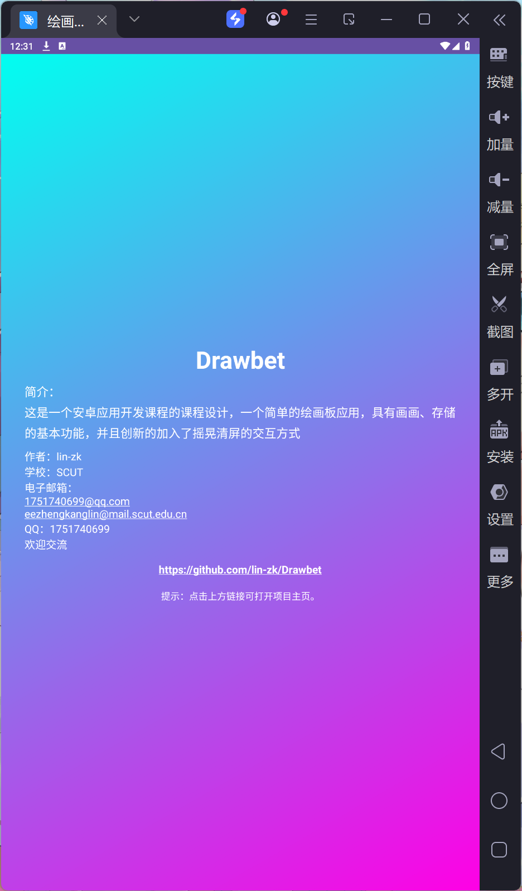

[中文](README.md) | [English](README_EN.md) | 日本語

# Drawbet - シンプルお絵描きアプリ

---

## 📱 アプリ概要

Drawbet は、直感的に使えるAndroidお絵描きアプリです。複数のブラシスタイル、色のカスタマイズ、作品履歴管理などの機能を搭載しています。いつでもどこでも創造的なひらめきを形にするのに最適なアプリです。

---

## 📖 機能紹介

### 🏠 ホーム画面


- **新規作成**：新しい作品を作成でき、カスタム命名が可能です（デフォルト形式：`新規キャンバス_現在時刻`）
- **作品を続ける**：最後に編集した作品を素早く読み込めます
- **作品履歴**：保存された全ての作品を閲覧・管理できます
- 美しいイラスト背景に半透明のオーバーレイを重ね、お絵描きアプリのテーマに合った美しいデザインを実現
- 画面下部に作者情報を表示

### 🎨 お絵描き画面


- **描画ツール**：4つの描画モードから選択可能
  - ブラシ：自由に曲線を描けます
  - 消しゴム：描いた内容を消去できます
  - 円形：円や楕円を描けます
  - 矩形：四角形を描けます
- **ブラシサイズ調整**：スライダーでブラシの太さをリアルタイムに調整でき、左側の円形プレビューで現在のサイズを確認できます
- **色調整**：RGBスライダーでブラシの色を自由にカスタマイズでき、左側の円形プレビューで現在の色をリアルタイムに確認できます
- **元に戻す/やり直し**：複数ステップの取り消しとやり直しに対応
- **キャンバスをクリア**：ワンタップでキャンバス全体をクリア（確認ダイアログ表示）
- **自動保存**：変更を検知すると自動的にデータベースに保存されます
- **画像エクスポート**：保存ボタンをタップすると作品をJPG画像としてギャラリーにエクスポート、長押しで履歴ページへ移動
- **シェイクでクリア**：端末を振るとキャンバスを素早くクリア（確認ダイアログ表示）
- **名前変更**：上部の作品タイトルをタップすると名前を変更できます
- **状態の保存**：変更時に元に戻す/やり直しスタックを自動保存

### 📂 作品履歴画面


- **検索機能**：入力と同時に即座に検索が実行され、一致した作品名の部分が赤くハイライト表示されます
- **新規作成**：右上の `+` ボタンをタップして新しい作品を作成できます
- **作品リスト**：
  - サムネイル、名前、最終更新日時を表示
  - 名前をタップすると名前変更が可能
  - 作品をタップすると編集モードで開きます
  - 一括選択用のチェックボックスに対応
- **一括操作**：
  - 全選択/選択解除：ワンタップで全ての作品を選択または選択解除
  - 反転：現在の選択状態を反転
  - 削除：選択した作品を一括削除
  - 保存：選択した作品をJPG画像として一括エクスポート
- 作品がない場合は「作品がありません。右上の + をタップして作成してください」と表示されます
- 多数の作品をスクロールして閲覧可能

### 👤 アバウトページ



- 「クリア」ボタンを長押しするとアバウトページにアクセスできます
- アプリのバージョン情報や開発者の詳細が表示されます
- アプリの基本情報を示すシンプルなインターフェースデザイン

---

## 🛠️ 技術実装

### プロジェクト構成
```
app/src/main/java/com/example/majordesign_master_v1/
├── MainActivity.java        # お絵描き画面のメインロジック
├── HomeActivity.java        # ホーム画面のロジック
├── HistoryActivity.java     # 履歴画面のロジック
├── WrittingView.java        # カスタム描画ビュー
├── AboutPage.java           # アバウトページ
├── data/                    # データ層
│   ├── DrawingDao.java      # データアクセスオブジェクト
│   ├── DrawingDatabase.java # Room データベース
│   ├── DrawingEntity.java   # 作品エンティティ
│   ├── DrawingRepository.java # データリポジトリ
│   ├── DrawingState.java    # 作品状態
│   └── BitmapConverters.java # ビットマップ変換ユーティリティ
└── history/                 # 履歴 UI
    ├── HistoryAdapter.java  # リストアダプター
    └── HistoryViewModel.java # ViewModel
```

### 主要技術
- **レイアウト**：LinearLayout による線形垂直レイアウト
- **カスタムビュー**：WrittingView でキャンバス機能を実装
- **データストレージ**：Room データベースで作品データを永続化
- **スタイルリソース**：drawable リソースで角丸矩形、円形ビュー、グラデーション背景などを実現
- **センサー**：加速度センサーでシェイクによるクリア機能を実装

### 🗂️ データとストレージ
- **自動保存**：お絵描き画面では30秒ごとに元に戻す/やり直しスタックが自動的に保存され、アプリがバックグラウンドに移行したり終了したりする際にも保存されます
- **ローカルデータベース**：Roomが作品名、サムネイル、キャンバスの状態（`DrawingState` / `BitmapConverters`）を保持します
- **画像エクスポート**：MediaStore経由でJPGファイルをシステムギャラリーに保存します。ファイル名は作品名を使用し、未命名の場合は `新規キャンバス_yyyyMMdd_HHmmss` が使用されます
- **権限**：画像のエクスポートにはギャラリーへの書き込み権限が必要です。Android 10以降では、レガシー権限不要のスコープドストレージを使用します

### 開発ステップの概要

1. ホーム、お絵描き、履歴の3つのメイン画面を構築
2. ホーム画面のレイアウトを設計し、新規作成、作品を続ける、作品履歴の3つのエントリーポイントを実装
3. お絵描き画面を設計し、ブラシサイズ調整、スタイル選択、キャンバス、色調整、アクションボタンを実装
4. 履歴画面を設計し、検索、作成、一括操作の機能を実装
5. 洗練されたUIエフェクトのためのdrawableとstyleリソースを作成
6. MainActivityのインタラクションロジックを実装
7. WrittingViewの描画機能を実装
8. HomeActivityの動作を実装
9. HistoryActivityで作品履歴管理を実装
10. データベースとUIインターフェース管理のためのdataとhistoryパッケージを作成
11. アバウトページを設計

---

## 🚀 プロジェクトの実行

### 必要環境
- Android Studio 2024.1以降（Android Gradle Plugin 8対応）
- Android SDK：compileSdk 36 / targetSdk 36、minSdk 24
- JDK 11
- Gradle Wrapper 8.13（プロジェクトに同梱）

### ビルド手順
```bash
# プロジェクトをクローン
git clone https://github.com/lin-zk/Drawbet.git
cd Drawbet
# プロジェクトをビルド
./gradlew build
```

---

## 📄 ライセンス

本プロジェクトは **[MITライセンス](LICENSE)** の下で公開されています。

---

## 🤝 作者について
- **作者**：lin-zk
- **メールアドレス**：1751740699@qq.com / eezhengkanglin@mail.scut.edu.cn
- **QQ**：1751740699
- **お気軽にご連絡ください**

---

## 🙏 特別感謝

- **Copilotの優れたコード生成とデバッグ機能により、本プロジェクトの実装に大きく貢献いただきました**
- **[「ご注文はうさぎですか？」新作アニメ制作決定！お祝いアート](https://gochiusa.com/anime10th/contents/c06080000.html?utm_source=x&utm_medium=post&utm_campaign=tp2025)を本プロジェクトのホーム画面イラスト背景として使用させていただきました**
- **SCUTで開講された組込みシステムとモバイルアプリケーション設計のコースと、ご指導いただいた2名の先生方**
